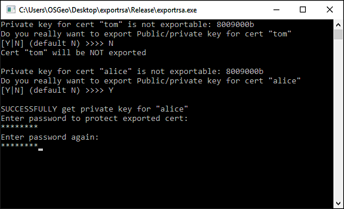

=================================================
Exporting Windows Non-Exportable RSA Private Keys
=================================================

This project has been directly inspired by the follwing paper and slideshow:

https://www.nccgroup.trust/globalassets/our-research/uk/whitepapers/exporting_non-exportable_rsa_keys.pdf

https://www.nccgroup.trust/globalassets/resources/uk/presentations/2011/blackhat_europe_2011_exporting_non-exportable_rsa_keys.pdf

by Jason Geffner <jason.geffner@ngssecure.com> of NCC Group (UK)

https://www.nccgroup.trust/uk/our-services/security-consulting/

Executables
~~~~~~~~~~~

Pre-built ``exportrsa.exe`` executables are located in:

DEBUG: `exportrsa/Debug/`_ (requires Visual Studio 2010 installed)

RELEASE: `exportrsa/Release/`_ (requires only Visual Studio 2010 runtime installed)

Code
~~~~

Visual Studio 2010 build project:

`exportrsa/exportrsa.sln`_

The single code file is here:
    
`exportrsa/exportrsa/exportrsa.cpp`_

How to use
~~~~~~~~~~

The code parses all system key stores and exports in .pxf files for all certificates that have a RSA private key available.

Just run ``exportrsa.exe`` in a command shell:

   
   Sample run of ``exportrsa.exe``

If you receive an error due to missing the ``msvcr100.dll`` (release version), you will need to install the `vcredist_x86_2010.exe`_ runtime. To use the debug version, you will need Visual Studio 2010 installed.

.. _exportrsa/exportrsa.sln: ./exportrsa/exportrsa.sln
.. _vcredist_x86_2010.exe: https://www.microsoft.com/en-us/download/details.aspx?id=5555
.. _exportrsa/Debug/: ./exportrsa/Debug/
.. _exportrsa/Release/: ./exportrsa/Release/
.. _exportrsa/exportrsa/exportrsa.cpp: ./exportrsa/exportrsa/exportrsa.cpp
